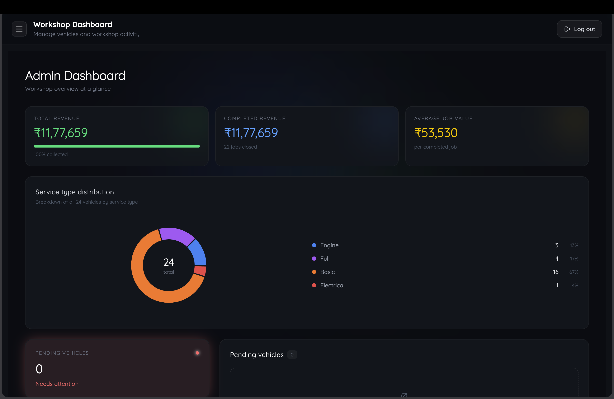
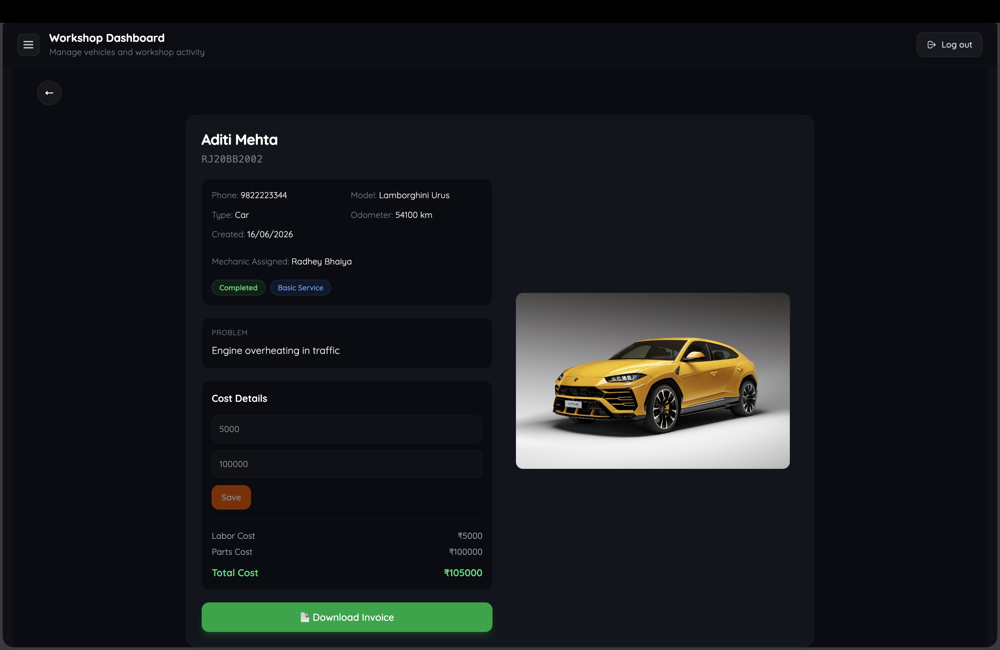
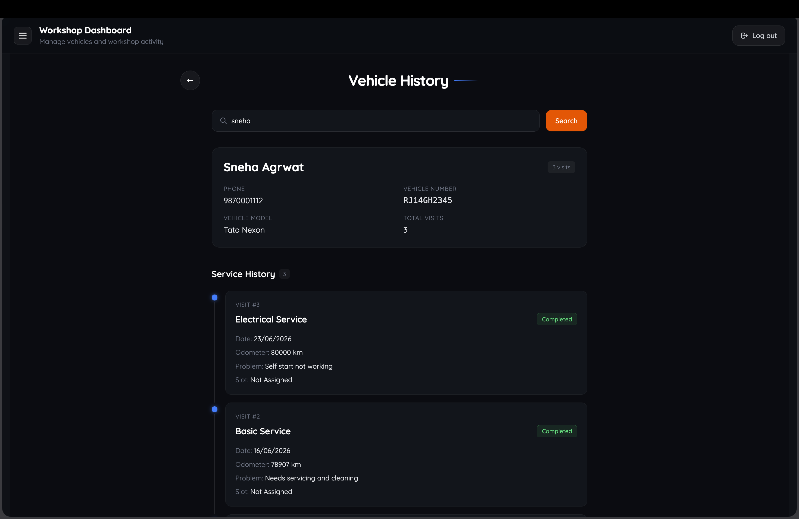
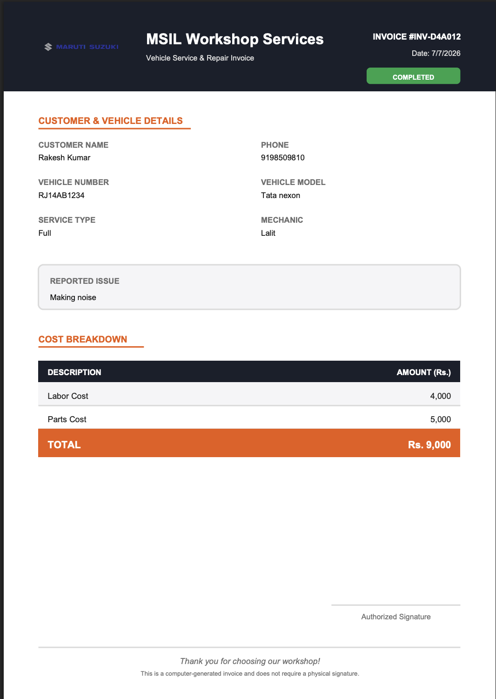

# 🚗 Workshop Management System (WMS)

A full-stack **Workshop Management System** built using the **MERN Stack** to streamline workshop operations such as vehicle registration, mechanic assignment, slot management, service tracking, and invoice generation.

🔗 **Live Demo:** https://workshop-management-system-frontend.vercel.app/

---

## 📸 Screenshots

| Dashboard | Vehicle Details |
|-----------|-----------------|
|  |  |

| Vehicle History | Invoice |
|-------------|---------|
|  |  |

---

# ✨ Features

## Authentication & Authorization

- JWT Authentication
- Secure Login System
- Role-Based Access Control
    - 👨‍💼 Admin
    - 🧑‍💻 Receptionist
    - 🔧 Technician

---

## Vehicle Management

- Register new vehicles
- Upload vehicle images
- Edit vehicle details
- Delete completed vehicles
- Search vehicles instantly
- View complete service history

---

## Workshop Workflow

- Automatic workshop slot allocation
- Queue management when all slots are occupied
- Automatic slot reassignment after job completion
- Live status tracking

Vehicle Statuses:

- Pending
- In Progress
- Completed

---

## Mechanic Management

- Add mechanics
- Assign mechanics to vehicles
- Track assigned jobs
- Only assigned technicians/admin can mark jobs as completed

---

## Billing

- Labour Cost
- Parts Cost
- Automatic Total Calculation
- Printable Invoice Generation

---

## Dashboard

- Live statistics
- Active vehicles
- Completed jobs
- Pending queue
- Workshop overview

---

# 🛠 Tech Stack

## Frontend

- React
- React Router
- Tailwind CSS
- Framer Motion
- Axios
- React Toastify
- ShadCN UI
- HTML2Canvas
- jsPDF

---

## Backend

- Node.js
- Express.js
- MongoDB
- Mongoose
- JWT Authentication
- Multer
- Cloudinary

---

## Deployment

- Frontend → Vercel
- Backend → Vercel
- Database → MongoDB Atlas
- Image Storage → Cloudinary

---

# 📂 Folder Structure

```
Workshop-Management-System
│
├── frontend
│   ├── components
│   ├── context
│   ├── pages
│   ├── assets
│   └── App.jsx
│
├── backend
│   ├── config
│   ├── controllers
│   ├── middleware
│   ├── models
│   ├── routes
│   ├── utils
│   └── server.js
│
└── README.md
```

---

# ⚙️ Installation

## Clone Repository

```bash
git clone https://github.com/abhinavherefr/workshop-management-system.git
```

---

## Backend Setup

```bash
cd backend
npm install
```

Create a `.env` file.

```env
PORT=4000

MONGODB_URI=your_mongodb_uri

JWT_SECRET=your_secret

CLOUDINARY_CLOUD_NAME=your_cloud_name
CLOUDINARY_API_KEY=your_api_key
CLOUDINARY_API_SECRET=your_api_secret
```

Run backend

```bash
npm run dev
```

---

## Frontend Setup

```bash
cd frontend
npm install
```

Create a `.env` file.

```env
VITE_BACKEND_URL=http://localhost:4000
```

Run frontend

```bash
npm run dev
```

---

# 🔒 User Roles

| Role | Permissions |
|------|-------------|
| Admin | Full access |
| Receptionist | Register vehicles, manage customers |
| Technician | View assigned vehicles, complete jobs |

---

# 🚀 Future Improvements

- Email/SMS Notifications
- Online Appointment Booking
- Payment Gateway Integration
- Analytics Dashboard
- Inventory Management
- Customer Portal
- Service Reminders

---

# 📚 What I Learned

During this project I gained hands-on experience with:

- Full-stack MERN development
- REST API design
- JWT authentication
- Role-based authorization
- MongoDB schema design
- Image uploads using Cloudinary
- Queue management logic
- Production deployment on Vercel
- Environment variable management
- Building scalable CRUD applications

---

# 👨‍💻 Author

**Abhinav Sharma**

GitHub:
https://github.com/abhinavherefr

LinkedIn:
(Add your LinkedIn URL)

---

## ⭐ Support

If you found this project helpful, consider giving it a ⭐ on GitHub!
